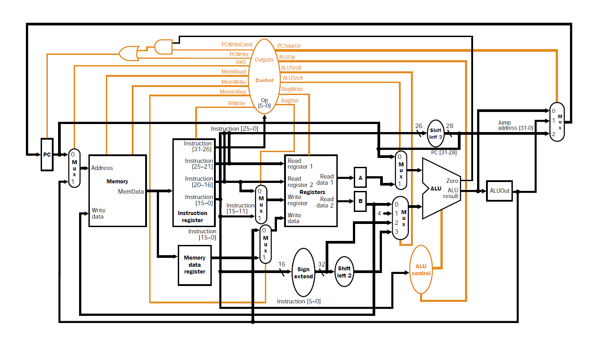

# Multi-Cycle MIPS32 Processor (VHDL)

## 📚 Overview

This project implements a **MIPS32 multi-cycle processor** in **VHDL**, simulating how the MIPS architecture handles instruction execution across multiple clock cycles. Each instruction passes through several stages: **Fetch, Decode, Execute, Memory Access, and Write Back** — with control managed by a finite state machine (FSM).

This processor supports a subset of MIPS32 instructions, including:
- R-type: `add`, `sub`, `and`, `or`, `slt`, `xor`, `nor`, `sll`, `srl`, `sra`
- I-type: `lw`, `sw`, `beq`, `addi`, `andi`, `ori`
- J-type: `j`

## 🛠️ Architecture

The processor is divided into the following main components:

### 🔧 Components

- **Program Counter (PC)**
- **Instruction Memory**
- **Instruction Register (IR)**
- **Register File**
- **ALU (Arithmetic Logic Unit)**
- **ALU Control Unit**
- **Control Unit**
- **MUXes and Sign/ZERO Extenders**
- **Shift Left**
- **Temp Registers**

### ⏱️ Execution Stages

1. **IF (Instruction Fetch)**  
   - Reads the instruction from memory using `PC`.
2. **ID (Instruction Decode / Register Fetch)**  
   - Decodes instruction and reads `rs`, `rt`.
3. **EX (Execute / Address Calculation)**  
   - ALU performs operation or address calculation.
4. **MEM (Memory Access)**  
   - Loads/stores data from/to memory.
5. **WB (Write Back)**  
   - Writes result back to the register file.

### 💡 Features

- 32-bit data path and instruction width
- FSM-based control unit for multicycle timing
- ALU operations mapped via `ALUOp`, `func`, and `Op`
- Instruction memory and Register file memory modeled using arrays
- Simulation testbench included

### 🧭 Project Architecture Diagram

The following diagram illustrates the structure of the MIPS32 multicycle processor:

